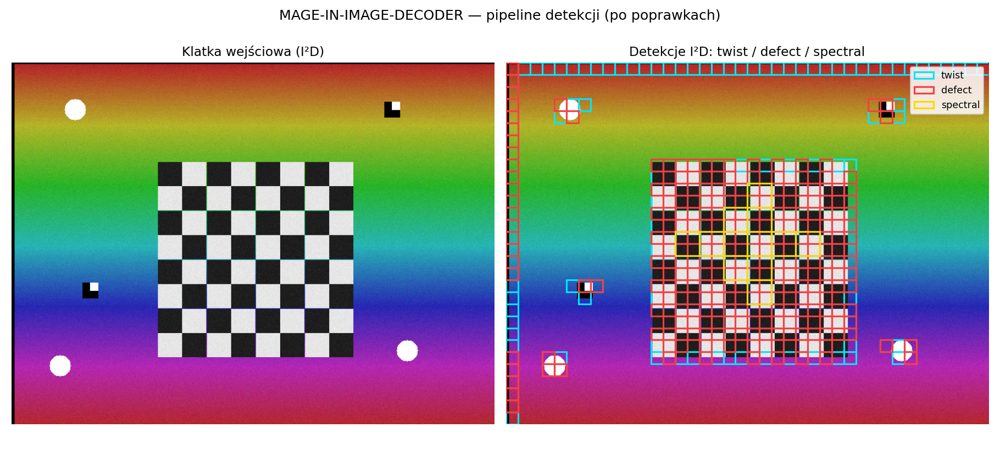
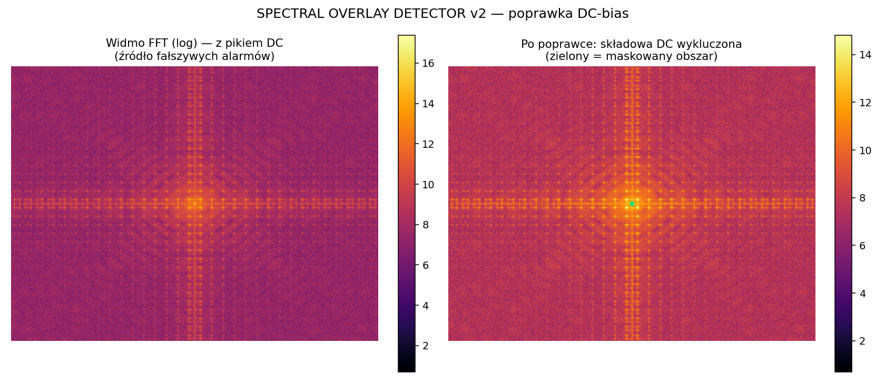
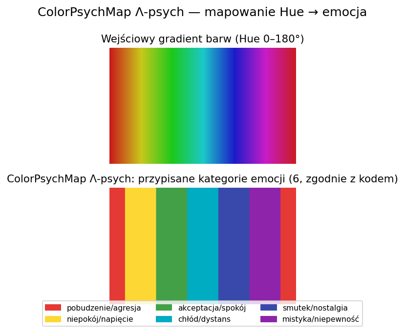
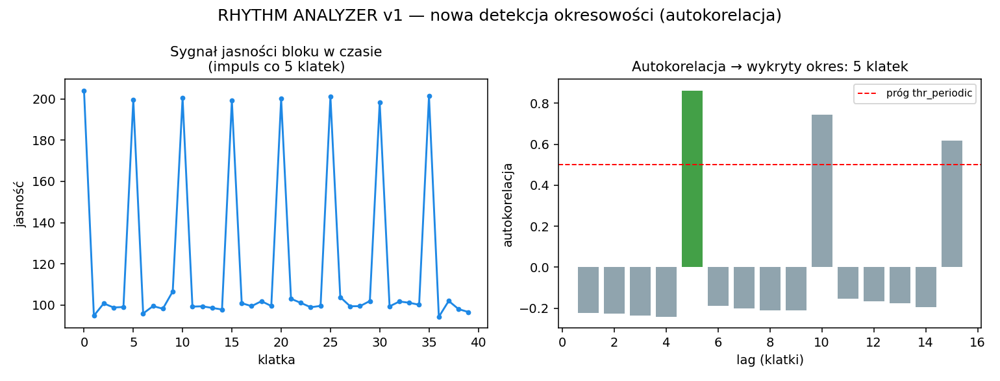

# MAGE-IN-IMAGE-DECODER (I²D)

Modularny system analizy obrazu, ruchu, koloru i widma. Pięć niezależnych
detektorów (skręt, defekty, rytm, emocja koloru, anomalie widmowe FFT)
łączy się w jedną listę "punktów fuzji" — miejsc, gdzie kilka sygnałów
wskazuje na to samo.

📘 Dokumentacja online: https://jbackk-lang.github.io/
📝 Historia poprawek i szczegóły techniczne: [CHANGELOG.md](CHANGELOG.md)

## 📸 Zrzuty ekranu


*Pipeline na klatce testowej — `twist` (cyjan), `defect` (czerwony), `spectral` (żółty).*


*Poprawka DC-bias: po lewej widmo FFT z fałszywym pikiem DC, po prawej po wykluczeniu.*


*ColorPsychMap Λ-psych — Hue zmapowany na 6 kategorii emocji.*


*RhythmAnalyzer — autokorelacja poprawnie wykrywa okres sygnału testowego.*

## 🔧 Instalacja

```
pip install -r requirements.txt
```

Wymaga `opencv-python` i `numpy` (Python 3.8+).

## 🚀 Szybki start

```python
from i2d_core import run_i2d

detections = run_i2d("nagranie.mp4")            # wideo
# albo:
detections = run_i2d("zdjecie.png", mode="image")  # pojedynczy obraz

for d in sorted(detections, key=lambda d: d.strength, reverse=True)[:5]:
    print(d.dtype, d.x, d.y, round(d.strength, 1))
```

Gotowy raport tekstowy (statystyki, top detekcje, punkty fuzji):

```python
from i2d_core import load_video, split_layers, run_i2d
from fusionengine_v1 import fusion_engine
from reportengine_v1 import report_engine

frames = load_video("nagranie.mp4")
split_layers(frames)
detections = run_i2d("nagranie.mp4")
fusion = fusion_engine(frames, detections)
print(report_engine(frames, detections, fusion))
```

> Importuj z plików bez spacji w nazwie (`i2d_core`, `fusionengine_v1`,
> `reportengine_v1`, `rhythm_analyzer_v1`, `colorpsychmap_v1`,
> `colorpsychmap_lambda_psych`, `spectral_overlay_detector_v2`) — to
> kanoniczne moduły. Pliki ze spacjami w nazwie to tylko zachowane dla
> kompatybilności aliasy, patrz [CHANGELOG.md](CHANGELOG.md).

## 🧩 Moduły — skrót

| Moduł | Wykrywa | Warstwa |
|---|---|---|
| TwistDetector | lokalna asymetria / skręt obrazu | L (jasność) |
| DefectScanner v2 | nagłe zmiany, zniknięcia, przełączenia | M (ruch) |
| RhythmAnalyzer | puls, miganie, okresowość (L/V/M) | L, C, M |
| ColorPsychMap Λ-psych | dominująca emocja koloru w bloku | C (HSV) |
| SpectralOverlayDetector v2 | anomalie FFT, siatki, pierścienie, piki | F (widmo) |
| FusionEngine | łączy wszystkie 5 w "punkty fuzji" | — |
| ReportEngine | raport tekstowy (ranking, statystyki) | — |

## 🎯 Zastosowania — jak i gdzie

- **Wykrywanie manipulacji wideo / ukrytych nakładek** — `run_i2d(path)`
  na nagraniu; `twist`/`defect`/`spectral_*` w punktach fuzji zwykle
  wskazują miejsce edycji lub doklejoną warstwę.
- **Sygnały sterujące, propaganda, reklama** — `RhythmAnalyzer` (miganie,
  pulsowanie, okresowość) razem z `ColorPsychMap` (emocjonalny ładunek
  koloru w czasie) na materiale wideo.
- **Astronomia** — `SpectralOverlayDetector` na FFT klatek (linie
  widmowe, pierścienie, rotacja pola) + `TwistDetector` (skręt struktur,
  asymetrie).
- **Kontrola jakości transmisji / streamu** — `DefectScanner` na wideo
  live (`mode="video"`), alarmuje na zniknięciach, przełączeniach warstw,
  dziurach w sygnale.
- **Fizyka sygnałów** — `SpectralOverlayDetector` (piki harmoniczne,
  rezonanse) — patrz ostrzeżenie o DC-bias w [CHANGELOG.md](CHANGELOG.md).
- **Automatyczny raport dla człowieka** — `report_engine()` zwraca gotowy
  tekst zamiast surowej listy `Detection` (patrz przykład wyżej).

Dalsze kierunki rozwoju (GPU/CUDA FFT, optyczny przepływ, segmentacja
semantyczna, heatmapy, Realtime I²D z kamery/streamu) — opisane w kodzie
poszczególnych modułów, nieprzetestowane.

## 🧪 Testy

```
pip install pytest
pytest tests/ -v
```

22 testy: import każdego modułu, tożsamość obiektu dla plików-aliasów,
pozytywna/negatywna kontrola DC-bias, próg adaptacyjny DefectScannera,
okresowość RhythmAnalyzera (L/V/M), pełne działanie `run_i2d()`.

## 📄 Licencja

MIT — patrz [LICENSE](LICENSE).
