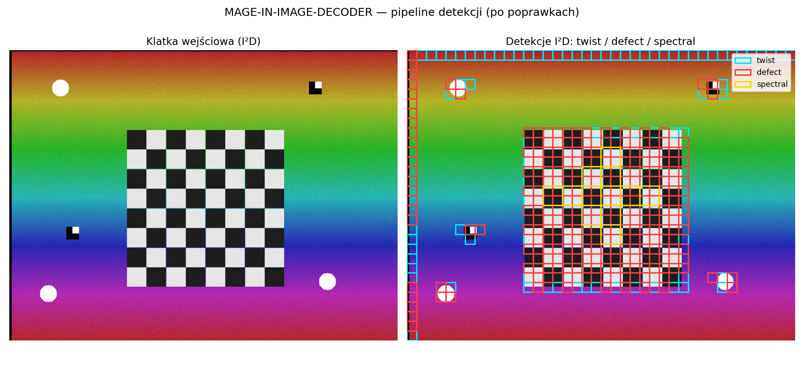
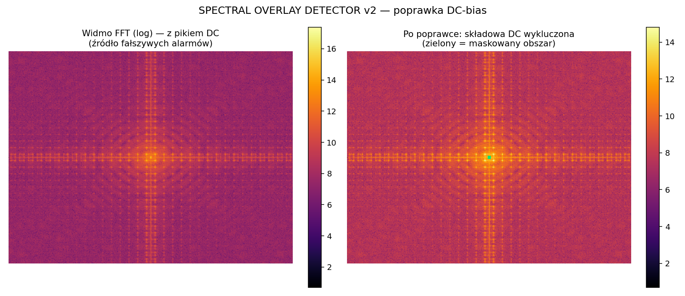
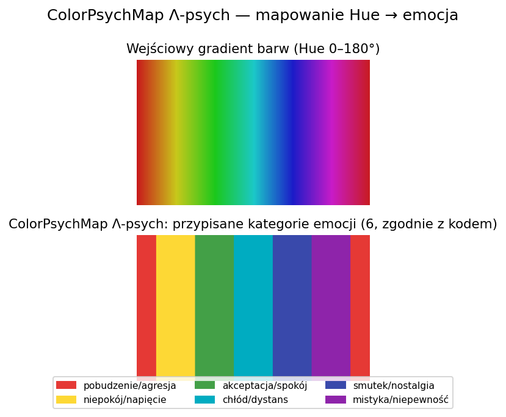
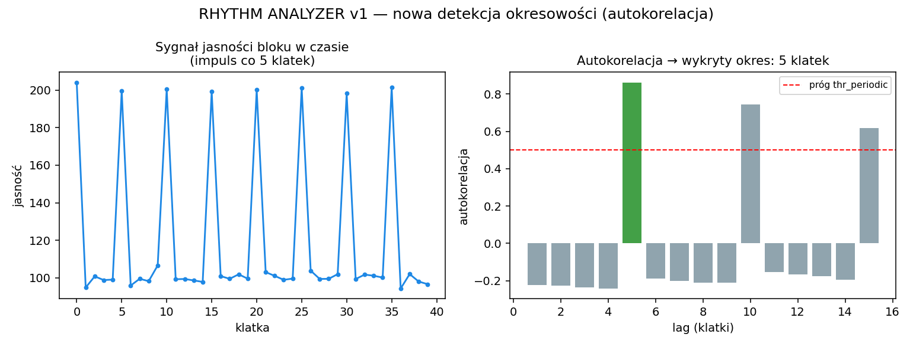

# MAGE-IN-IMAGE-DECODER (I²D)

Modularny system analizy obrazu, ruchu, koloru i widma. Pięć niezależnych
detektorów (skręt, defekty, rytm, emocja koloru, anomalie widmowe FFT)
łączy się w jedną listę "punktów fuzji" — miejsc, gdzie co najmniej
dwie różne rodziny detektorów wskazują ten sam blok. Jest to wskazówka
do oględzin, nie skalibrowane prawdopodobieństwo ani dowód manipulacji.

📘 Dokumentacja online: https://jbackk-lang.github.io/
📝 Historia poprawek i szczegóły techniczne: [CHANGELOG.md](CHANGELOG.md)

## 📸 Zrzuty ekranu


*Pipeline na klatce testowej — `twist` (cyjan), `defect` (czerwony), `spectral` (żółty).*


*Poprawka DC-bias: po lewej widmo FFT z fałszywym pikiem DC, po prawej po wykluczeniu.*


*ColorPsychMap Λ-psych — Hue zmapowany na 6 kategorii emocji.*


*RhythmAnalyzer — autokorelacja poprawnie wykrywa okres sygnału testowego.*

## 🔧 Instalacja

```
pip install -r requirements.txt
```

Wymaga `opencv-python` i `numpy` (Python 3.8+).

## 🚀 Szybki start

```python
from i2d_core import run_i2d

detections = run_i2d("nagranie.mp4")            # wideo
# albo:
detections = run_i2d("zdjecie.png", mode="image")  # pojedynczy obraz

for d in sorted(detections, key=lambda d: d.strength, reverse=True)[:5]:
    print(d.dtype, d.x, d.y, round(d.strength, 1))
```

Gotowy raport tekstowy (statystyki, top detekcje, punkty fuzji):

```python
from i2d_core import load_video, split_layers, run_i2d
from fusionengine_v1 import fusion_engine
from reportengine_v1 import report_engine

frames = load_video("nagranie.mp4")
split_layers(frames)
detections = run_i2d("nagranie.mp4")
fusion = fusion_engine(frames, detections)
print(report_engine(frames, detections, fusion))
```

Fuzja nie sumuje już nieporównywalnych wartości `strength`: jej wynik to
liczba rodzin detektorów (np. `spectral_peak` i `spectral_ring` to jedna
rodzina). Raport szereguje surowe wyniki osobno dla każdego typu.

> Importuj z plików bez spacji w nazwie (`i2d_core`, `fusionengine_v1`,
> `reportengine_v1`, `rhythm_analyzer_v1`, `colorpsychmap_v1`,
> `colorpsychmap_lambda_psych`, `spectral_overlay_detector_v2`) — to
> kanoniczne moduły. Pliki ze spacjami w nazwie to tylko zachowane dla
> kompatybilności aliasy, patrz [CHANGELOG.md](CHANGELOG.md).

## 🧩 Moduły — skrót

| Moduł | Wykrywa | Warstwa |
|---|---|---|
| TwistDetector | lokalna asymetria / skręt obrazu | L (jasność) |
| DefectScanner v2 | nagłe zmiany, zniknięcia, przełączenia | M (ruch) |
| RhythmAnalyzer | puls, miganie, okresowość (L/V/M) | L, C, M |
| ColorPsychMap Λ-psych | dominująca emocja koloru w bloku | C (HSV) |
| SpectralOverlayDetector v2 | anomalie FFT, siatki, pierścienie, piki | F (widmo) |
| FusionEngine | łączy wszystkie 5 w "punkty fuzji" | — |
| ReportEngine | raport tekstowy (ranking, statystyki) | — |
| META_DYNAMICS v0.1 | Λ/τ/ρ na siatce regionów ruchu (eksperymentalne, poza `run_i2d()`) | M (ruch) |
| CONTOUR_CURVATURE v0.1 | krzywizna dyskretna konturów 2D, wykrywanie splicingu (eksperymentalne, poza `run_i2d()`) | G (kontury/krawędzie) |

### META_DYNAMICS v0.1 (eksperymentalne)

Przeniesienie formalizmu Λ-τ-ρ z ekosystemu TIMDR (sygnały wibracyjne/
sejsmiczne) na pole ruchu wideo — osobna gałąź, NIE wpięta do
`run_i2d()`/`FusionEngine` (status eksperymentalny, wynik mieszany, patrz
niżej). Pełna specyfikacja: [`PREREG_META_DYNAMICS_v0.1.md`](PREREG_META_DYNAMICS_v0.1.md).
Wynik testu na realnym podzbiorze UCSD Ped2 (`data/ucsd_ped2/`, patrz
[`data/ucsd_ped2/README.md`](data/ucsd_ped2/README.md) po źródło):
[`RESULT_META_DYNAMICS_v0.1.md`](RESULT_META_DYNAMICS_v0.1.md) —
**mieszany**: kontrole syntetyczne przeszły, ale na realnych danych tylko
1 z 3 klipów testowych dał istotny efekt na Λ, a binarna flaga ρ nie
zadziałała w ogóle (stała progowa `k=3.5` okazała się zbyt wysoka - Λ i E nie przekroczyły
progu nawet w szczycie, więc flaga nie miała szansy zadziałać).

**v0.2 — próba kalibracji `k`, wynik: STOP na bramce.**
[`PREREG_META_DYNAMICS_RHO_CALIBRATION_v0.1.md`](PREREG_META_DYNAMICS_RHO_CALIBRATION_v0.1.md)
skalibrowało `k=2.0` na osobnym zbiorze (`data/ucsd_ped2_calibration/`,
rozłącznym z Test001-003), ale ponowna bramka syntetyczna
([`PREREG_META_DYNAMICS_v0.2.md`](PREREG_META_DYNAMICS_v0.2.md)) wykazała,
że `k=2.0` nie ma bezpiecznego marginesu — na innym scenariuszu
syntetycznym niż ten użyty w kalibracji fałszywy alarm wychodzi dokładnie
na granicy progu. Zgodnie z protokołem stop-if-failed, `Test001-003`
NIE zostały ponownie dotknięte. Pełny wynik:
[`RESULT_META_DYNAMICS_v0.2.md`](RESULT_META_DYNAMICS_v0.2.md) —
**ocena całościowa: ρ NOT SUPPORTED (żadne k nie daje stabilnego progu),
Λ pozostaje częściowym tropem (1 z 3 klipów, niepotwierdzone).**
Traktuj całą gałąź jako zamkniętą eksplorację, nie gotową detekcję.
Pre-rejestracje META_DYNAMICS i CONTOUR_CURVATURE trafiły do gita w tych
samych commitach co wyniki, więc kolejność „reguły przed wynikiem”
potwierdza tylko ich treść, nie historia repozytorium.
Dashboard pokazuje historyczne `rho` wyłącznie informacyjnie; nie używa
go jako zwalidowanego alarmu.

```python
from i2d_core import load_video, split_layers
from meta_dynamics_v1 import compute_reference_thresholds, compute_video_meta_states

ref_frames = load_video("zdrowe_referencyjne.mp4")
split_layers(ref_frames)
thresholds = compute_reference_thresholds(ref_frames)

test_frames = load_video("do_sprawdzenia.mp4")
split_layers(test_frames)
states = compute_video_meta_states(test_frames, thresholds)  # lista VideoMetaState (Lambda/tau/rho/E per klatka)
```

Osobny, **opisowy** odczyt TIMDR dla własnego filmu (bez progu, `rho`
i werdyktu) można uruchomić:

```
python timdr_video_diagnostics.py nagranie.mp4 --max-frames 300 --output opis.json
```

Raport JSON zawiera szeregi i kwantyle Λ, τ oraz energii ruchu. Status
`EXPLORATORY_ONLY` oznacza, że wynik nie klasyfikuje anomalii i nie
otwiera ponownie klipów `Test001-003` do strojenia. Analiza, czy ten
kierunek jest użyteczny, wymaga nowego prerejestru i niezależnego zbioru.

### CONTOUR_CURVATURE v0.1 (eksperymentalne, G-branch)

Krzywizna dyskretna konturów 2D (`cv2.Canny`+`cv2.findContours`, klasyczny
wzór na krzywiznę krzywej płaskiej — kąt zmiany kierunku na jednostkę
długości łuku) — osobna gałąź, NIE wpięta do `run_i2d()`/`FusionEngine`
(status eksperymentalny). NIE jest związana z operatorem Weingartena
(siatki 3D, `TIMDR-Geometry-Formalism`) ani z `detect_twist()`
(niepowiązana asymetria jasności bloku pikseli) — patrz uzasadnienie w
[`PREREG_CONTOUR_CURVATURE_v0.1.md`](PREREG_CONTOUR_CURVATURE_v0.1.md)
sekcja 0. Hipoteza: regiony obrazu ze wklejoną/skopiowaną treścią
(splicing/copy-move) mają wyższą gęstość szczytów krzywizny na granicy
wklejenia niż regiony naturalne. Wynik testu na realnym podzbiorze
CASIA v2 (`data/casia2_splicing_sample/`, patrz
[`PREREG_CONTOUR_CURVATURE_v0.1_ADDENDUM.md`](PREREG_CONTOUR_CURVATURE_v0.1_ADDENDUM.md)):
[`RESULT_CONTOUR_CURVATURE_v0.1.md`](RESULT_CONTOUR_CURVATURE_v0.1.md) —
**CZĘŚCIOWO SUPPORTED, niska moc (N=4)**: bramka syntetyczna przeszła
czysto (7/7 testów), ale na realnych danych tylko 1 z 4 obrazów dał
istotny efekt (po korekcie Bonferroniego) — jedyny publicznie dostępny
podzbiór CASIA v2 z ground truth ma tylko 4 przykłady (oryginalny zbiór
nie jest już hostowany publicznie). Traktuj jako wstępny trop wymagający
replikacji na większym zbiorze, nie gotową detekcję.

```python
from contour_curvature import compute_reference_threshold, region_kappa_density
import cv2

ref_images = [cv2.imread(p, cv2.IMREAD_GRAYSCALE) for p in ["tlo1.png", "tlo2.png"]]
threshold = compute_reference_threshold(ref_images)

img = cv2.imread("do_sprawdzenia.png", cv2.IMREAD_GRAYSCALE)
density = region_kappa_density(img, threshold, roi=(100, 100, 200, 200))  # (x0,y0,x1,y1)
```

## 🎯 Zastosowania — jak i gdzie

- **Wykrywanie manipulacji wideo / ukrytych nakładek** — `run_i2d(path)`
  na nagraniu; `twist`/`defect`/`spectral_*` w punktach fuzji zwykle
  wskazują miejsce edycji lub doklejoną warstwę.
- **Sygnały sterujące, propaganda, reklama** — `RhythmAnalyzer` (miganie,
  pulsowanie, okresowość) razem z `ColorPsychMap` (emocjonalny ładunek
  koloru w czasie) na materiale wideo.
- **Astronomia** — `SpectralOverlayDetector` na FFT klatek (linie
  widmowe, pierścienie, rotacja pola) + `TwistDetector` (skręt struktur,
  asymetrie).
- **Kontrola jakości transmisji / streamu** — `DefectScanner` na wideo
  live (`mode="video"`), alarmuje na zniknięciach, przełączeniach warstw,
  dziurach w sygnale.
- **Fizyka sygnałów** — `SpectralOverlayDetector` (piki harmoniczne,
  rezonanse) — patrz ostrzeżenie o DC-bias w [CHANGELOG.md](CHANGELOG.md).
- **Automatyczny raport dla człowieka** — `report_engine()` zwraca gotowy
  tekst zamiast surowej listy `Detection` (patrz przykład wyżej).

Dalsze kierunki rozwoju (GPU/CUDA FFT, optyczny przepływ, segmentacja
semantyczna, heatmapy, Realtime I²D z kamery/streamu) — opisane w kodzie
poszczególnych modułów, nieprzetestowane.

## 🖥️ Dashboard (na żywo)

```
pip install -r requirements.txt
python app.py
```

Otwiera się na `http://localhost:5050`. Strona per moduł (wszystkie 7:
5 stabilnych detektorów + META_DYNAMICS + CONTOUR_CURVATURE) pokazuje
gotowy przykład (wejście + nałożone oznaczenia detekcji + statystyki) oraz
formularz do wgrania własnego obrazu/wideo i uruchomienia detekcji na
żywo. META_DYNAMICS i CONTOUR_CURVATURE mają wyraźną plakietkę
"eksperymentalny" i notatkę o realnym, częściowym/mieszanym wyniku
(patrz `RESULT_META_DYNAMICS_v0.2.md`, `RESULT_CONTOUR_CURVATURE_v0.1.md`)
— dashboard nie ukrywa niepełnych wyników.
Wgrywane wideo ma limit 300 klatek, 12 mln pikseli łącznie i 20 MB;
zbyt duży plik jest odrzucany jawnie, a nie po cichu obcinany.
Główny interfejs `run_i2d()`
nadal wczytuje cały film do pamięci, więc długie nagrania wymagają
partiowego pipeline'u w przyszłej wersji.

### Szybkie nakładki stereo

Na stronie `/stereo` wgraj osobno lewy i prawy obraz tej samej sceny.
Dashboard pokaże anaglif czerwono-cyjanowy i kolorową nakładkę
disparycji. Obrazy muszą mieć te same wymiary i najlepiej być po
rektyfikacji; bez kalibracji aparatów mapa **nie podaje odległości w
metrach**. To podgląd, nie zwalidowany detektor defektów.

To samo bez GUI:

```
python stereo_overlay.py lewy.png prawy.png --output-dir stereo_output
```

### Minimalna predykcja przez podobieństwo

Na stronie `/similarity` można wgrać trzy obrazy: badany, prawidłowy i
anomalny przykład. Moduł `anomaly_similarity.py` porównuje z góry ustalone
cechy koloru, krawędzi i układu przestrzennego. Zwraca podobieństwo do obu
przykładów, wskazuje bliższy i pokazuje poglądową nakładkę różnic. Jeśli
różnica podobieństw jest mała, odpowiada `NIEROZSTRZYGNIĘTE`.

To **nie jest prawdopodobieństwo anomalii ani zwalidowana diagnoza**.
Obrazy muszą mieć tę samą rozdzielczość i porównywalny kadr oraz
oświetlenie. Mała lokalna wada może zostać zdominowana przez wspólne tło;
do wiarygodnej oceny potrzeba oznaczonych, niezależnych przykładów.

### Laboratorium porównań CDnet 2014

`cdnet_benchmark.py` porównuje na tych samych klatkach 10 masek: trzy
bazowe (`DefectScanner`, `DefectScanner + TwistDetector` przez
`FusionEngine` oraz klasyczny MOG2) i 7 wariantów z polem wektorów ruchu
(opisanych w raportach niżej). Tylko te dwie rodziny I²D mają w tym porównaniu
współrzędne przestrzenne zgodne z maskami CDnet. Kolor, rytm, widmo i
opisowe Λ/τ NIE są domyślnie zaliczane jako pikselowa maska ruchu.

Mały, oficjalny przykład do uruchomienia lokalnie (surowe dane są
domyślnie w `../data/cdnet2014` obok repo, poza Git):

```
python download_cdnet.py pedestrians
python cdnet_benchmark.py ../data/cdnet2014/baseline/pedestrians --output benchmark_reports/pedestrians.json
```

Źródło i opis etykiet: https://changedetection.net/dataset2014/ .
Skrypt akceptuje także `highway`, `canoe` i `fountain01`. Dla każdej sekwencji
raportuje precision, recall, F1, fałszywe alarmy i czas na klatkę.
Do oceny trafiają tylko klatki z `temporalROI.txt` oraz piksele z
etykietami 0 (tło) lub 255 (ruch), wewnątrz `ROI.bmp`; etykiety 50,
85 i 170 są pomijane. `--max-frames N` służy tylko do próby technicznej
i oznacza wynik jako `PARTIAL`. Jedna sekwencja pokazuje działanie kodu,
ale nie dowodzi przewagi ani uogólnienia. CDnet mierzy wykrywanie
ruchu/tła, nie wykrywanie manipulacji, intencji lub anomalii Ped2.
Rzeczywisty pilotaż na dwóch sekwencjach i jego ograniczenia opisuje
[`RESULT_CDNET_PILOT.md`](RESULT_CDNET_PILOT.md). W tym pilotażu fuzja nie poprawiła wyniku w praktycznym sensie względem
pojedynczego detektora (F1: pedestrians −0.020, fountain01 +0.001).

Dalsza, jawnie **eksploracyjna** próba pola wektorowego jest w
[`RESULT_CDNET_VECTOR_EXPLORATION.md`](RESULT_CDNET_VECTOR_EXPLORATION.md).
MOG2 połączony z kierunkowo spójnym ruchem poprawił F1 na obu
sekwencjach, lecz był ok. 5–6× wolniejszy od MOG2 (czasy zależą od maszyny; w powtórce
audytu 4.5–5.5×). To była faza
eksploracyjna; następną parę sekwencji opisuje osobny raport poniżej.

Sprawdzenie bez zmian progów na dwóch nowych sekwencjach jest w
[`RESULT_CDNET_INDEPENDENT_v0.1.md`](RESULT_CDNET_INDEPENDENT_v0.1.md):
F1 rośnie na `highway` i `canoe`, ale metoda nadal jest 3.8–4.0× wolniejsza od MOG2 (w powtórce audytu
4.0–4.6×). F1 wszystkich raportów CDnet odtwarza się co do 4 miejsc przy
ponownym uruchomieniu na surowych klatkach (`docs/audit/`). Wszystkie surowe klatki CDnet są trzymane poza
repo w `../data/cdnet2014`.

Próba zmniejszenia kosztu (ROI z rzadkim LK vs. przepływ co drugą
klatkę) jest w [`RESULT_CDNET_ROI_SUBSAMPLE_v0.1.md`](RESULT_CDNET_ROI_SUBSAMPLE_v0.1.md).
Na `highway` i `canoe` przeliczanie pola co 2 klatki zachowuje prawie
cały F1 pełnej fuzji przy około 1.6× krótszym czasie; rzadki LK w ROI
wyraźnie traci recall. To wynik eksploracyjny na ponownie użytych danych.

### Film względem zdrowej referencji

Na stronie `/vector-reference` można wgrać zdrowy film referencyjny
i badany film **tego samego kadru, rozdzielczości i FPS**. Kod
`vector_reference.py` opisuje każdą parę klatek cechami pola wektorów
ruchu: medianą i 90. percentylem jego długości, spójnością kierunku
oraz średnią bezwzględną wirowością. Na pierwszych 60% zdrowych par
kalibruje medianę/MAD, a na pozostałych 40% próg kontrolny; badany film
nie uczestniczy w kalibracji. Wynik to odchylenie RMS z czterech
znormalizowanych kanałów, seria kolejnych przekroczeń i wykres w czasie.

To adaptacja **metody zdrowej referencji** z analizy łożysk, nie
połączenie obrazu z pomiarem drgań. Chronoproces podpowiedział jawne
uporządkowanie czasu, ale czas z FPS jest tylko nominalny: bez
rzeczywistych timestampów, rodziny trajektorii Γ(t,s) i osobnych rzutów
M/S/G/K ten moduł **nie jest pełnym Chronoprocesem**. Progi nie były
walidowane na niezależnym, oznaczonym zbiorze rzeczywistych filmów;
wyniku nie należy czytać jako prawdopodobieństwa usterki.

Bez panelu:

```
python vector_reference.py zdrowy.avi badany.avi --output benchmark_reports/vector_reference.json
```

## 🧪 Testy

```
pip install pytest
pytest tests/ -v
```

45 testów, w tym 22 w `tests/test_i2d_core.py`: import każdego modułu, tożsamość obiektu dla plików-aliasów,
pozytywna/negatywna kontrola DC-bias, próg adaptacyjny DefectScannera,
okresowość RhythmAnalyzera (L/V/M), pełne działanie `run_i2d()`; pozostałe 23 dotyczą podobieństwa, CDnet,
fuzji/diagnostyki, nakładek stereo i zdrowej referencji. Osobno,
11 testów dla META_DYNAMICS v0.1/v0.2 (`test_meta_dynamics_v1.py` —
kontrole syntetyczne k=3.5 i k=2.0 + jednostkowe (w tym jeden
dokumentujący znany STOP bramki v0.2, patrz `RESULT_META_DYNAMICS_v0.2.md`),
`test_meta_dynamics_ped2_real.py` — regresja na realnym podzbiorze UCSD
Ped2, pomijana automatycznie jeśli `data/ucsd_ped2/` nie jest obecne).
Osobno, 7 testów dla CONTOUR_CURVATURE v0.1 (`test_contour_curvature.py` —
jednostkowe + kontrola pozytywna/negatywna, patrz
`RESULT_CONTOUR_CURVATURE_v0.1.md`); test główny na realnych danych
(`real_contour_curvature_casia2.py`) to skrypt raportujący, nie
`pytest` (N=4, za mało na sensowną regresję automatyczną).

## 📄 Licencja

MIT — patrz [LICENSE](LICENSE).
